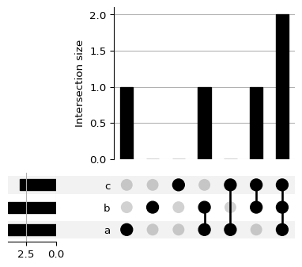
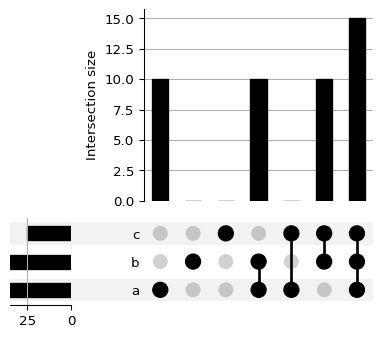
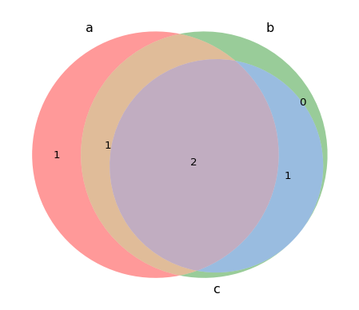
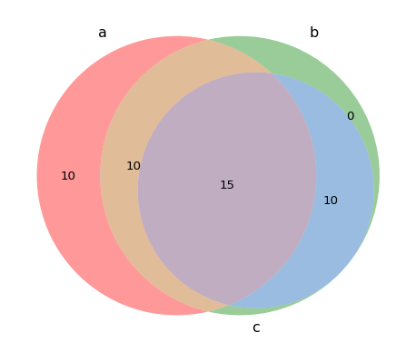

# {millefeuille}

This repository contains python and R scripts to help process genomic
coordinates files (BED, GFF).

## gff_to_bed.py

Reverse complement of the bed_to_gff script. This script takes a GFF
file and converts it into a BED formatted file (BED12 or BED6).
Selection on the molecular type and feature type to extract in the
arguments.

Creates BED files from a given GFF file with specific filters. In BED12,
groups all the elements of a selected molecular type according to their
feature

``` python
from millefeuille.module import gff2bed as g2b

g2b.bed12_generator(file_gff="./tests/sample.gff", bedname="sample")

g2b.bed6_generator(file_gff="./tests/sample.gff", bedname="sample")
```

## bed_to_gff.py

Reverse complement of the gff_to_bed script. This script takes a BED
file and converts it into a GFF formatted file. Works on BED12 and BED6.

Creates GFF file from a given BED file. Note that the features of the
GFF are created based on the ID of the BED file.

``` python
from millefeuille.module import bed2gff as b2g

b2g.get_gff(file_bed = "./tests/sample1.bed12",
            source = "test_source",
            mol_type = "test_mol_type",
            make_gff3 = True)
```

## summary_region_overlaps.R

This script makes a diagnosis graph to assess the level of mutual
overlap between three sets of genomic coordinates. Given three BED
files, it outputs a Venn diagram and an Upset plot like the one here.
Wether or not you apply the `--expand` argument as `TRUE` or `FALSE`,
you get frequency of overlaps in terms of number of regions
(`--expand FALSE`) or in terms of number of basepairs (`--expand TRUE`,
by default).

``` python
from millefeuille.module import overlaps as ov

# default : upset plot, cout in number of regions
ov.plot_overlaps(
    list_bed=["./tests/sample1.bed", "./tests/sample2.bed", "./tests/sample3.bed"]
)

# with expand = TRUE, upset plot, cout in number of basepairs
ov.plot_overlaps(
    list_bed=["./tests/sample1.bed", "./tests/sample2.bed", "./tests/sample3.bed"],
    as_bp=True,
)

# with expand = FALSE, venn diagram, cout in number of regions
ov.plot_overlaps(
    list_bed=["./tests/sample1.bed", "./tests/sample2.bed", "./tests/sample3.bed"],
    as_venn=True,
)

# with expand = TRUE, venn diagram, cout in number of basepairs
ov.plot_overlaps(
    list_bed=["./tests/sample1.bed", "./tests/sample2.bed", "./tests/sample3.bed"],
    as_bp=True,
    as_venn=True,
)
```





    /Users/flochlay/code/matpellzo/millefeuille/.venv/lib/python3.13/site-packages/matplotlib_venn/layout/venn3/pairwise.py:169: UserWarning: Bad circle positioning.
      warnings.warn("Bad circle positioning.")



    /Users/flochlay/code/matpellzo/millefeuille/.venv/lib/python3.13/site-packages/matplotlib_venn/layout/venn3/pairwise.py:169: UserWarning: Bad circle positioning.
      warnings.warn("Bad circle positioning.")


