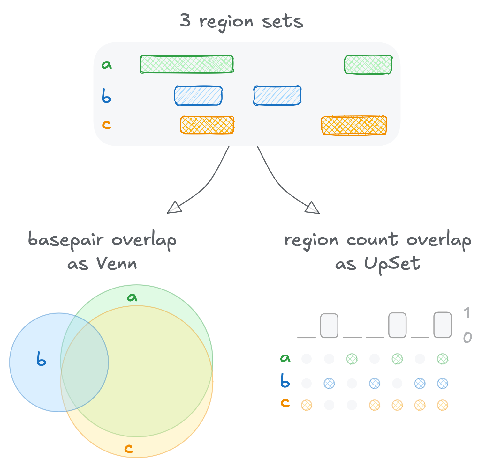

# `{millefeuille}`

```{python}
# | include: false

import warnings

# ignore pandas FutureWarnings
warnings.simplefilter(action="ignore", category=FutureWarning)

```

This python package is here to help process and explore genomic coordinates files (BED, GFF).

## Overlap counts



Create a diagnosis graph to assess the level of mutual overlap between three sets of genomic coordinates. Given a set  of three region lists of coordinates as  BED files, you can compute the respective counts for each type of overlap (two or three layer overlap) and output a Venn diagram or an Upset plot.

The results comes in different flavors :

- use `as_bp=True` to get count as number of **basepairs** overlaps
- use `as_bp=False` to get count as number of **regions** overlaps
- use `as_venn=True` to get a **Venn diagram**
- use `as_venn=False` to get an **UpSet plot**

### Count as region overlaps

```{python}
#| warning: false

from millefeuille.module import overlaps as ov

# default : upset plot, cout in number of regions
ov.plot_overlaps(
    list_bed=["./tests/sample1.bed", "./tests/sample2.bed", "./tests/sample3.bed"]
)

# with expand = FALSE, venn diagram, cout in number of regions
ov.plot_overlaps(
    list_bed=["./tests/sample1.bed", "./tests/sample2.bed", "./tests/sample3.bed"],
    as_venn=True,
)
```

### Count as basepair overlaps

```{python}
#| warning: false

# with expand = TRUE, upset plot, cout in number of basepairs
ov.plot_overlaps(
    list_bed=["./tests/sample1.bed", "./tests/sample2.bed", "./tests/sample3.bed"],
    as_bp=True,
)

# with expand = TRUE, venn diagram, cout in number of basepairs
ov.plot_overlaps(
    list_bed=["./tests/sample1.bed", "./tests/sample2.bed", "./tests/sample3.bed"],
    as_bp=True,
    as_venn=True,
)
```

## File format conversion

### GFF to BED

Take a GFF file and converts it into a BED formatted file (BED12 or BED6). Add a selection on the molecular type and feature type to extract the argument of interest. For the conversion to BED12, the regions are grouped according to their molecular type and feature information.

```{python}
# | eval: false

from millefeuille.module import gff2bed as g2b

g2b.bed12_generator(file_gff="./tests/sample.gff", bedname="sample")

g2b.bed6_generator(file_gff="./tests/sample.gff", bedname="sample")
```

### BED to GFF

Reverse complement of the `g2b` module. This command takes a BED file and converts it into a GFF-formatted file. Works on BED12 and BED6. Note that the features of the output GFF are created based on the ID of the BED file.

```{python}
#| eval: false

from millefeuille.module import bed2gff as b2g

b2g.get_gff(file_bed = "./tests/sample1.bed12",
            source = "test_source",
            mol_type = "test_mol_type",
            make_gff3 = True)
```
